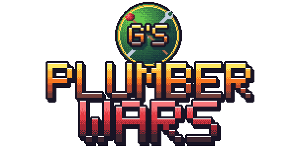
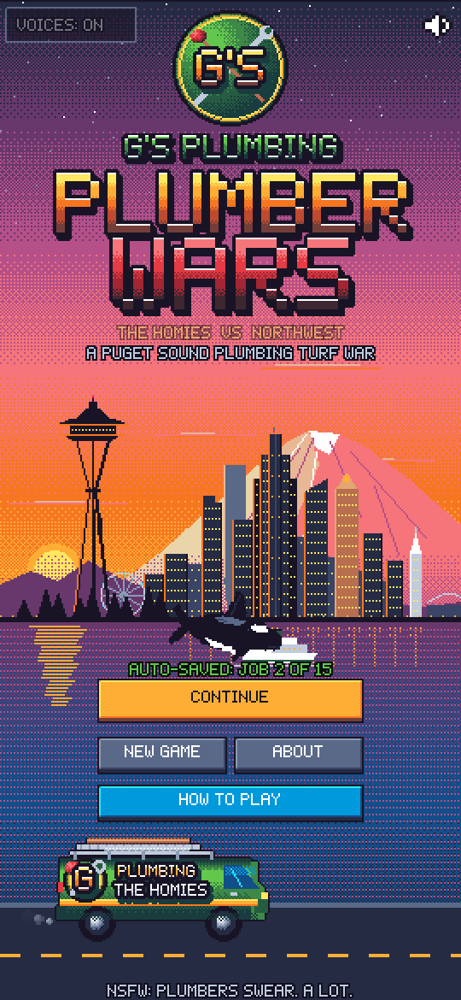
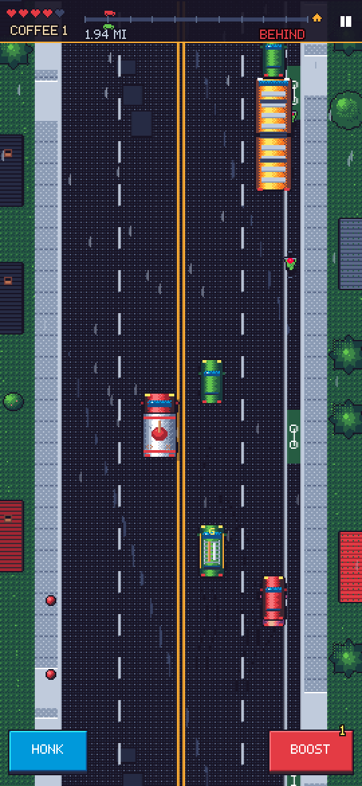
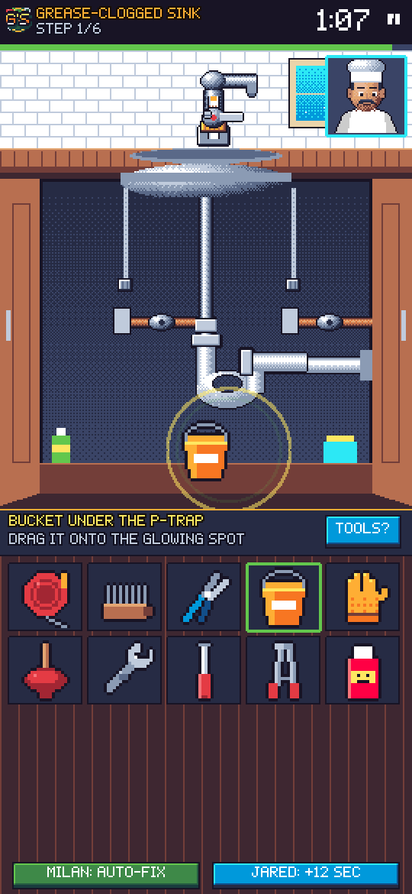
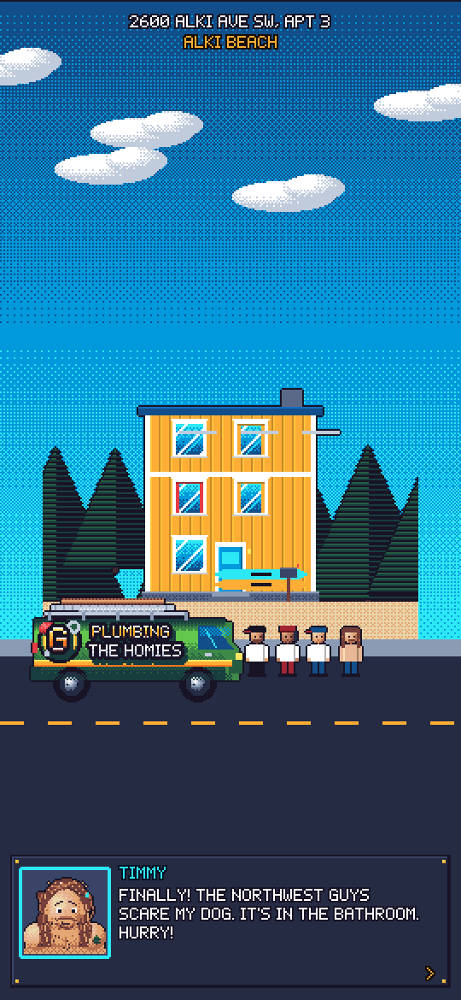
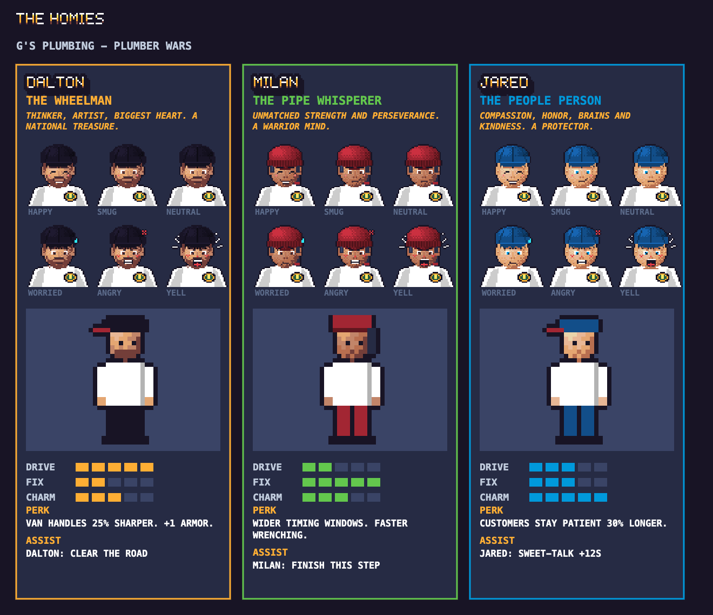
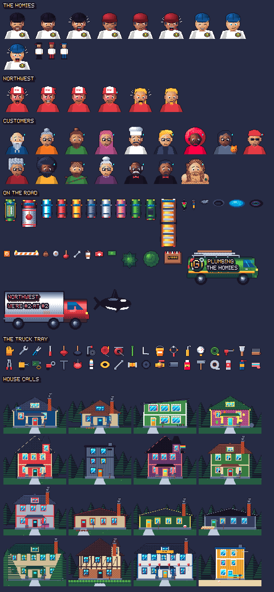
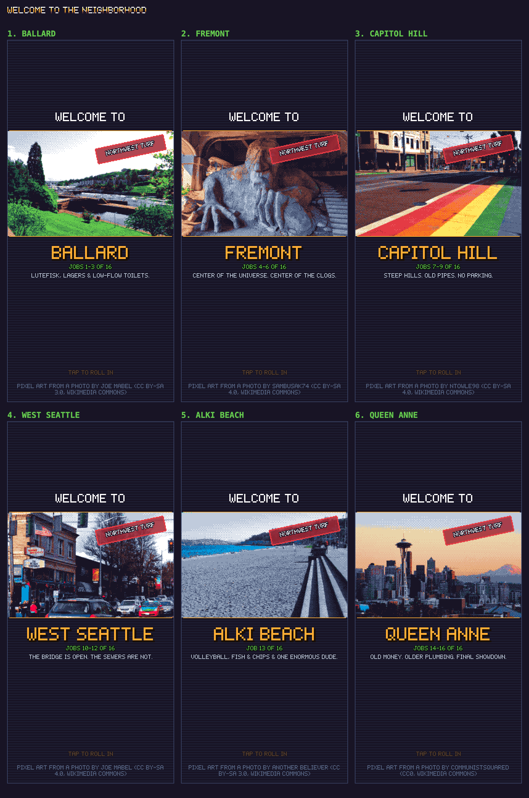

<p align="center"></p>

<p align="center"><b>A mobile-first 16-bit arcade game about Seattle's finest plumbers and their filthy-mouthed rivals.</b><br>
<a href="https://plumberwars.timknab.dev">Play it in your browser</a> · built with Phaser 3 · every pixel and beat generated in code</p>

<p align="center">
  
  
  
  
</p>

The Homies of **G's Plumbing** (Dalton, Milan, Jared) race the foul-mouthed **Northwest** crew across Seattle,
then fix real plumbing problems before the customer loses it and calls the competition.

> **NSFW:** the Northwest guys swear. A lot. Voices can be switched off on the title screen.

## The game

<p align="center"></p>

- **Pick a lead homie.** Dalton (wheelman: sharper handling, +1 armor), Milan (pipe whisperer: wider timing
  windows, fewer turns), Jared (people person: 30% more customer patience). The other two always ride along,
  each with a one-time assist in the race and in the repair: *Dalton* clears the road / shows you the right
  tool, *Milan* patches the van (+1 armor) / auto-fixes a step, *Jared* stalls Randy on the radio / sweet-talks
  +12s. Keys Q and E.
- **Welcome to the neighborhood.** Each district opens with pixel art of the real place (the Ballard Locks,
  the Fremont Troll, Capitol Hill's rainbow crosswalk, the West Seattle Junction, the Kerry Park view, Alki Beach).
- **Something to find in every room.** A lava lamp in Fremont, husky fur in the shower, a cat poster in the
  basement, garden gnomes and banana slugs in Queen Anne, glowing raccoon eyes in the crawlspace.
- **High scores.** Your total is your best score on every job, added up. Post it with arcade initials from
  **HIGH SCORES** on the title (or the finale); champions who beat all 16 jobs get a crown.
- **About pages.** Meet the crew (what each homie brings: brains, back, bedside manner) and flip through all six
  neighborhoods with their pixel art, a bit of real history and the plumbing you'll find there.
- **New here?** Tap **HOW TO PLAY** on the title screen (first-time players see it automatically).
  Progress **saves automatically** after every finished job (lead homie, unlocked jobs, stars) in your browser;
  hit **CONTINUE** to pick up where you left off.
- **A real Seattle.** The dispatch map is drawn from real coordinates (Ship Canal, Lake Union, Lake Washington,
  Elliott Bay, West Seattle), each pin with its own landmark icon.
- **Dispatch.** The customer calls, a homie picks up (they take turns), then Northwest cuts in on the CB radio
  to claim the job.
- **The race** (top-down, Spy Hunter style). Beat the Northwest box truck to the house. They ram you (watch for the
  red flash), throw turds / TP / plungers / wrenches, and yell obscenities over the radio (recorded voices; the music
  ducks so you hear every word). Shove them into curbs and traffic, grab espresso for BOOST, honk to clear your lane.
  Oncoming traffic from Fremont on; potholes, puddles, oil, cyclists, raccoons, road work. You pull up to the
  actual house at the end.
- **The repair.** Each job is the real sequence a plumber follows. Every step: grab the right tool from the truck
  tray, then do the gesture (circle to turn valves — righty-tighty matters — plunge in rhythm, hold for torque,
  drag parts, pull, scrub, tap leaks, sweep a sewer camera). Wrong tools and wrong order cost time and make the customer madder. Rack up mistakes (or dents in the race)
  and your homies' help buttons light up.
  A pro tip explains each real step, and the clock pauses while you read it.
- **How pros do it.** Every job has a card with the real-world standard behind the fix (drain slope, trap seals,
  80 psi max house pressure, T&P valves, backflow protection, who owns a Seattle side sewer...). Open it from
  **TOOLS?** mid-repair (clock paused) or from the results screen. Based on the Uniform Plumbing Code Washington
  uses plus common trade practice; `src/data/standards.js`.
- **16 jobs** across 6 neighborhoods: Ballard, Fremont, Capitol Hill, West Seattle, then **Alki Beach** (Timmy's
  clogged tub, required) before the Queen Anne showdown. Rising difficulty: longer, faster races; a meaner,
  faster rival; tighter repair clocks and timing windows; tool hints only in Ballard; from Capitol Hill on you
  pick the next step yourself.

### The 16 jobs (common Seattle-area calls)

| District | Jobs |
|---|---|
| Ballard | Clogged toilet · Dripping faucet (cartridge) · Slow shower drain (hair) |
| Fremont | Running toilet (flapper) · Grease-clogged kitchen sink (P-trap) · Jammed disposal |
| Capitol Hill | Low water pressure (PRV) · Leaky supply line · Rocking toilet / wax ring |
| West Seattle | No hot water (flush + relight) · Sump pump dead in a storm · Burst pipe from a freeze |
| Alki Beach | Clogged bathtub at Timmy's: stopper, overflow plate, zip-it (plus one squirrel acorn), rag + plunge |
| Queen Anne | Roots in the sewer line · Leaky frost-free hose bib · Seized main shutoff (finale) |

## Under the hood

- **Game:** Phaser 3 + Vite, a 270px-wide pixel canvas, mobile-first. Every sprite, room, house, map and font is
  drawn procedurally in code (no image editor involved).
- **Sound:** a WebAudio synth engine for the SFX and an EDM soundtrack; Big Randy, Skeeter and the crew are voiced
  with Google Cloud Text-to-Speech (Chirp 3 HD), pre-rendered to MP3 so they play instantly on phones.
- **Real places:** openly licensed Wikimedia Commons photos, converted to the game palette with ordered dithering.
- **Server:** a zero-dependency Node server on Cloud Run (scale-to-zero) serving the game plus a Firestore-backed
  leaderboard.
- **Quality:** a `node:test` suite (content integrity, docs sync, voice regressions, leaderboard rules) and dev
  bots that auto-play every repair (`/?smoke=1`) and race every level (`/?racebot=1`).

## Controls (touch or keyboard)

| | Touch | Keyboard |
|---|---|---|
| Menus / dialogs | Tap | Enter / Space (Esc = back/skip) |
| Steer | Drag anywhere | Arrows or A / D |
| Boost | BOOST | Space, W or Up |
| Honk | HONK | H, Shift, S or Down |
| Dalton assist (clear the road, once per race) | CLEAR ROAD | C |
| Pick tool | Tap tray | 1–0 |
| Pick next step | Tap card | 1–3 |
| Milan / Jared assist | Buttons | Q / E |
| Repair gestures | Finger | Mouse |
| Pause · Sound · Voices | Icons | Esc/P · M · V |

## Art & sound

<p align="center"></p>

Everything is generated in code at boot — there are no image or audio asset files:

- `src/core/pixel.js` — a tiny pixel painter (dithered gradients, lit spheres/cylinders, auto-outlines) on the
  ENDESGA-32 palette.
- `src/art/*` — vehicles, roadside scenery, Seattle houses, repair close-ups, tools, portraits with moods, the
  G's badge, logo lettering, the Kerry Park skyline (and an orca).
- `src/core/music.js` — electronic soundtrack engine, 10 tracks: a big-room main theme (impact, snare-roll
  build, riser, supersaw drop), minimal tech house (dispatch), psytrance (race), tech house (repairs), deep house
  (map), piano house (job done), moody deep house (fired), festival-drop / tape-stop stings, big-room finale.
  Sine kicks with sidechain pump, stereo supersaws, plucks, acid lines, high-pass build sweeps, reverb +
  dotted-8th delay, glue compressor. `/?music=1` renders every track to `preview/*.wav` (dev server) with
  peak/RMS levels.
- `src/core/audio.js` — SFX (~40: supersaw plucks for the UI, drop hits for the countdown, a dubstep wub for
  wrong tools), engine drone, recorded voices.
- **Voices** — every spoken line is pre-recorded with Google Cloud Text-to-Speech (Chirp 3 HD voices: Big Randy,
  Skeeter and each Homie get their own) into `public/voice/`. Render new/changed lines with
  `node scripts/voices.mjs`; the browser's built-in speech is only a fallback.
  (Browsers never allow sound before the first tap, so the game opens on a TAP TO START screen. It fires on
  finger-up, the only touch phones count as a gesture, and on iPhone the game plays even with the silent switch on.)

### District intros

<p align="center"></p>

Starting each district shows a "Welcome to …" screen with pixel art of the neighborhood, Big Randy's welcome
and a Northwest-turf stamp. The art is made from openly licensed Wikimedia Commons photos: `node scripts/districts.mjs`
downloads them (and records credits in `public/districts/credits.json`), then `/?districts=1` on the dev server
crops each one and maps it onto the game palette with ordered dithering (`public/districts/*.png`). The pixel
versions are adaptations and keep the source licenses:

| District | Source photo | Photographer | License |
|---|---|---|---|
| Ballard | [Chittenden Locks overview 01.jpg](https://commons.wikimedia.org/wiki/File:Chittenden_Locks_overview_01.jpg) | Joe Mabel | CC BY-SA 3.0 |
| Fremont | [Fremont troll.jpg](https://commons.wikimedia.org/wiki/File:Fremont_troll.jpg) | Sambusak74 | CC BY-SA 4.0 |
| Capitol Hill | [Rainbow crosswalk Capitol Hill, Seattle.jpg](https://commons.wikimedia.org/wiki/File:Rainbow_crosswalk_Capitol_Hill,_Seattle.jpg) | Ntowle98 | CC BY-SA 4.0 |
| West Seattle | [West Seattle - west side of California Ave looking north from The Junction 01.jpg](https://commons.wikimedia.org/wiki/File:West_Seattle_-_west_side_of_California_Ave_looking_north_from_The_Junction_01.jpg) | Joe Mabel | CC BY-SA 4.0 |
| Queen Anne | [Seattle Kerry Park Skyline.jpg](https://commons.wikimedia.org/wiki/File:Seattle_Kerry_Park_Skyline.jpg) | CommunistSquared | CC0 |
| Alki Beach | [Alki Beach, Seattle, April 2012.JPG](https://commons.wikimedia.org/wiki/File:Alki_Beach,_Seattle,_April_2012.JPG) | Another Believer | CC BY-SA 3.0 |

### Real-crew sprites

Drop photo-derived pixel art for Dalton, Milan and Jared into `public/crew/` and list it in
`public/crew/manifest.json`; it replaces the generated portraits with no code changes.
Sizes, file names and a ready-made Gemini/Venice prompt are in [`public/crew/README.md`](public/crew/README.md).

## Develop

```bash
npm install
npm run dev        # open on your phone via your LAN IP
npm test           # content + docs-sync checks
npm run build
```

Dev helpers (dev server only):

| URL | What it does |
|---|---|
| `/?scene=Gallery` | Browse every sprite (tap to page) |
| `/?scene=Drive&job=6`, `/?scene=Repair&job=9` | Jump straight to a race or repair |
| `/?smoke=1` | Auto-plays every repair step of all 16 jobs (results in `window.__smoke`) |
| `/?racebot=1[&jobs=0,5&tries=4]` | A bot races each job at fast-forward (muted) to check every race is winnable (`window.__race`) |
| `/?docs=1` | Regenerates `docs/` (logo, sprite sheet, screenshots); run it in a phone-sized window |
| `/?districts=1` | Rebuilds the district intro pixel art from `tools/district-src/` (run `node scripts/districts.mjs` first) |
| `/?og=1` | Regenerates the 1200×630 link-preview card `public/og.png` |
| `/?assets=1` | Exports every character (all moods) and house to `docs/assets/` for the cast page |

`npm test` fails if the README, the About screen, the sprite sheet or the recorded voices drift from the game; see [CLAUDE.md](CLAUDE.md).

## Deploy (Google Cloud Run)

```bash
gcloud auth login
cp .env.example .env   # then set GCP_PROJECT (kept out of git)
bash deploy/deploy.sh
```

Builds the container with Cloud Build, deploys a public, scale-to-zero Cloud Run service, prints the URL
and writes a QR code to `deploy/plumber-wars-qr.png`. A Terraform alternative lives in `infra/`.

The container runs `server/server.mjs`, a zero-dependency Node server: it serves the built game and the
leaderboard API (`GET/POST /api/scores`), which stores entries in **Firestore** (`(default)` database, us-west1)
using the Cloud Run service account. Entries are validated in `server/scores.mjs` (three-letter initials, a
blocklist for slurs, 16 per-job bests each capped). `npm run dev` swaps in an in-memory stand-in.

### CI/CD

- **Pre-merge gates** (`.github/workflows/ci.yml`, every push and PR): `npm test`, `npm run build`, a server
  syntax check, `npm audit` (high/critical) and GitHub's dependency review on PRs.
- **Security:** CodeQL static analysis on pushes, PRs and weekly (`codeql.yml`); Dependabot keeps npm packages
  and Actions current.
- **Next (planned):** auto-deploy `main` to Cloud Run after the gates pass, using Workload Identity Federation
  (no service-account keys in GitHub), and a manual "deploy preview" workflow button that ships any branch to a
  tagged, zero-traffic Cloud Run URL for sharing (`gcloud run deploy --tag <branch> --no-traffic`).

## Credits & license

Game by [Tim Knab](https://timknab.dev). G's Plumbing and The Homies are a real crew; Northwest is fictional.
The code is MIT licensed; the G's Plumbing name, branding and the crew's names and likenesses are not (see
[LICENSE](LICENSE)).
